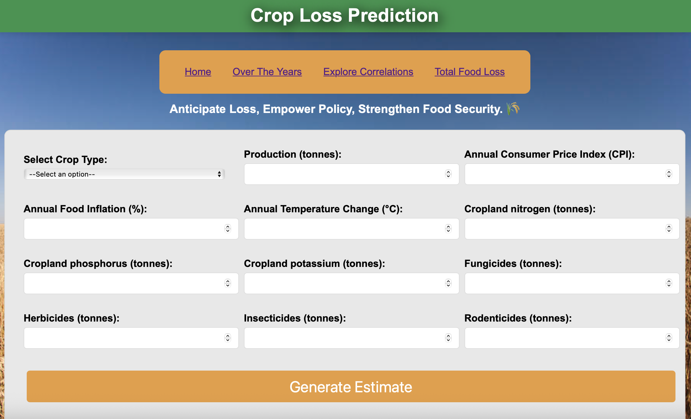

# Employing Machine Learning to Predict Food Loss in Agricultural Production and Post-Harvest Stages Using Temperature Changes, Nutrient Balance, Crop Yield, Pesticide Use, and Economic Indicators

### Objective: 
- The goal is to predict food loss and understand the significance of each factor. Why do we want to predict food loss?
    - Mitigating food insecurity: Enable policymakers to optimize food distribution.
    - Environmental sustainability: [Food loss and waste account for 8-10% of annual global greenhouse gas emissions](https://unfccc.int/news/food-loss-and-waste-account-for-8-10-of-annual-global-greenhouse-gas-emissions-cost-usd-1-trillion)
    - Reduce financial loss: Reduction of post-harvest losses incurred by farmers.
    - Policy/planning: Enable businesses and governments to implement targeted interventions and shape food policies.

### Why These Factors?  
- **Temperature Changes** – Affects crop growth, harvest timing, and spoilage rates, influencing overall food loss.  
- **Cropland Nutrient Balance** – Essential for healthy crop development; nutrient deficiencies can reduce yield and quality.  
- **Crop Yield** – Direct indicator of agricultural productivity; lower yields often lead to higher relative losses. Measured pre-loss to avoid data leakage. 
- **Pesticide Use** – Controls pests and diseases but excessive or insufficient use can impact crop health and lead to losses.  
- **Consumer Price Indices** – Food is heavily weighted in CPI. When the cost of harvesting and transporting food falls below market it becomes unprofitable to do so and leads to food loss.

### Datasets:
- **Source:** FAO [(Food and Agriculture Organization of the United Nations)](https://www.fao.org/faostat/en/#data).
- **Years Covered:** 2010–2022.

### Research:
- The [USDA website](https://www.ers.usda.gov/amber-waves/2020/march/food-loss-why-food-stays-on-the-farm-or-off-the-market/) was utilized to understand factors that affect food production.

### Website:
The website for crop loss prediction can be found [here](https://tranquil-inlet-09299-e56258c6ec48.herokuapp.com/).

### Model Selection and Tuning:

After experimenting with various models, the Random Forest Regressor was determined to be the most effective, achieving:

- Mean Absolute Error (MAE): 29.96
- R² Score: 0.64
- Root Mean Squared Error (RMSE): 112.84
- This high R² score indicates that the model explains 64% of the variance in food loss, reflecting fairly strong predictive capability.

#### Preprocessing Pipeline:
- Label encoding for crops.
- RandomizedSearchCV for efficient hyperparameter tuning.

### Conclusion

Analysis of agricultural factors such as pesticide application, nutrient balance, crop yield, economic indicators and temperature changes revealed valuable insights into their correlation with food loss. Transformations were made on the input variables to explore nonlinear relationships. The project also explored scaling methods and their influence on model accuracy.